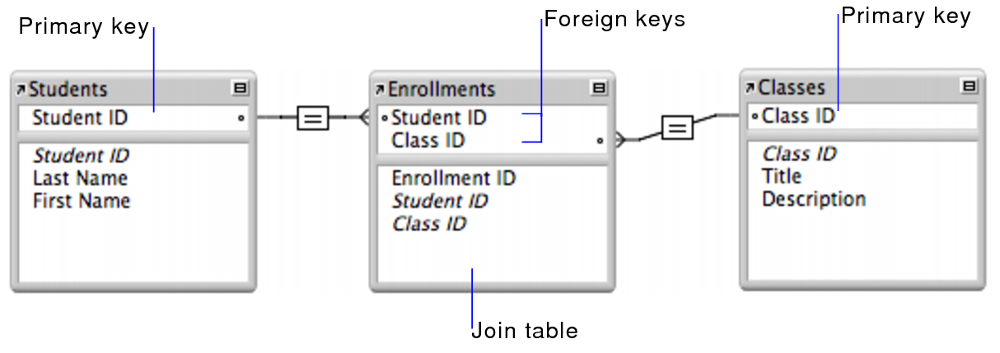
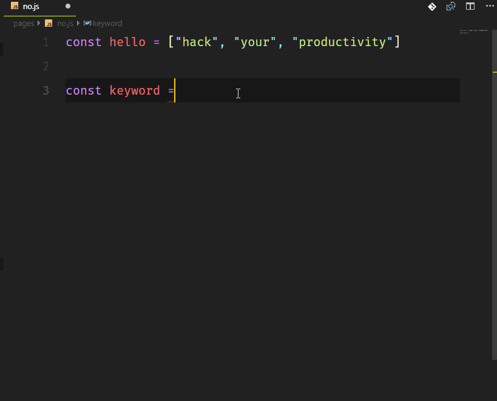

# Founders and Coders Rating
#### Our website on Heroku: [Fac_Rating](https://fac-rating.herokuapp.com/)
## project :date: Week 6 by :arrow_right: Ahlam &amp; Nareman  
#### This project involve setting up a database which connect to via a node.js server.
#### Our app is for all the students that involve in founders and coders bootcamps, the users as a students can enter there details and give rating for there cohorts.

### The project process:  
### Step :one: :   
#### organize the project files.  
#### The client side  
#### :open_file_folder: public folder:
* #### index.htm
* #### index.js
* #### style.class   

#### The server side   
#### :open_file_folder: src folder:
* #### server.js
* #### router.js
* #### handler.js   
#### :open_file_folder: database folder:
* #### db_build.js
* #### db_build.sql
* #### db_connection.js    
#### :open_file_folder: queries folder:
* #### getUserData.js
* #### postUserData.js  
#### :open_file_folder: tests folder:
* #### db_test.js
* #### serverTest.js

### Step :two: :  
#### installation:  
#### npm init, npm install, dotenv, pg, tape, supertest

### Step :three: :  
#### create the tables in the database file.  
#### For example this schema:

### Step :four: :  
#### Add and run tests that test the server and the database functions, for example tape-test.

### Step :five: :  
#### Add code in html css and javascript files to have a readable and pretty page and to run the app.

